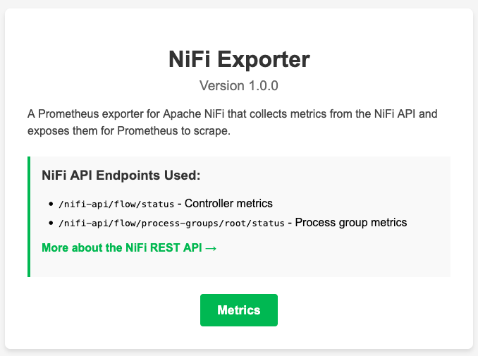

# NiFi Exporter for Prometheus

A Prometheus exporter for Apache NiFi that collects metrics from the NiFi API and exposes them for Prometheus to scrape.

## Metrics Exposed

This exporter collects metrics from two NiFi API endpoints:

### Controller Metrics (`/nifi-api/flow/status`)

- `nifi_active_thread_count`: Number of active threads in NiFi
- `nifi_terminated_thread_count`: Number of terminated threads in NiFi
- `nifi_files_queued`: Number of flow files queued in NiFi
- `nifi_bytes_queued`: Number of bytes queued in NiFi
- `nifi_running_count`: Number of running components in NiFi
- `nifi_stopped_count`: Number of stopped components in NiFi
- `nifi_invalid_count`: Number of invalid components in NiFi
- `nifi_disabled_count`: Number of disabled components in NiFi
- `nifi_active_remote_port_count`: Number of active remote ports in NiFi
- `nifi_inactive_remote_port_count`: Number of inactive remote ports in NiFi
- `nifi_up_to_date_count`: Number of up-to-date components in NiFi
- `nifi_locally_modified_count`: Number of locally modified components in NiFi
- `nifi_stale_count`: Number of stale components in NiFi
- `nifi_locally_modified_and_stale_count`: Number of locally modified and stale components in NiFi
- `nifi_sync_failure_count`: Number of sync failure components in NiFi

### Process Group Metrics (`/nifi-api/flow/process-groups/root/status`)

- `nifi_process_group_flowfiles_received`: Number of flowfiles received by the process group
- `nifi_process_group_flowfiles_sent`: Number of flowfiles sent by the process group
- `nifi_process_group_flowfiles_queued`: Number of flowfiles queued in the process group

### Health Metrics

- `nifi_api_up`: Whether the NiFi API is up (1) or down (0)
- `nifi_scrape_count`: Number of scrapes
- `nifi_scrape_errors`: Number of scrape errors

## NiFi REST API Documentation

This exporter uses the Apache NiFi REST API to collect metrics. For more information about the API, see the [Apache NiFi REST API Documentation](https://nifi.apache.org/docs/nifi-docs/rest-api/index.html).

## Requirements

- Python 3.6+
- Docker (for containerized deployment)

## Usage

### Running with Docker Compose

The easiest way to run the exporter is using Docker Compose:

```bash
docker-compose up -d
```

This will build the Docker image and start the exporter container, exposing the metrics on port 9100.

### Building and Running the Docker Image

#### Using the Convenience Script

A convenience script `run.sh` is provided to easily build and run the Docker container:

```bash
./run.sh
```

This will build the Docker image and run the container with default settings.

You can customize the behavior with various options:

```bash
./run.sh --url http://your-nifi-host:8080 --port 9101
```

Run `./run.sh --help` to see all available options.

#### Using Make for Docker Operations

The Makefile also includes commands for Docker operations:

```bash
# Build the Docker image
make docker-build

# Run the Docker container
make docker-run

# Stop the Docker container
make docker-stop

# Remove the Docker container and image
make docker-clean
```

You can customize the Docker container with environment variables:

```bash
NIFI_URL=http://your-nifi-host:8080 PORT=9101 make docker-run
```

#### Manually Building and Running

1. Build the Docker image:

```bash
docker build -t nifi-exporter .
```

2. Run the container:

```bash
docker run -d --name nifi-exporter -p 9100:9100 -e NIFI_URL=http://your-nifi-host:8080 nifi-exporter
```

### Running Without Docker


#### Using Make

The project includes a Makefile to simplify common operations:

```bash
# Install dependencies
make build

# Run the exporter
make run

# Test the exporter
make test

# Show all available commands
make help
```

You can customize the behavior with environment variables:

```bash
NIFI_URL=http://your-nifi-host:8080 PORT=9101 make run
```

#### Manual Setup

1. Install the required Python packages:

```bash
pip install -r requirements.txt
```

2. Run the exporter:

```bash
python nifi_exporter.py
```

### Testing the Exporter

A test script is included to verify that the exporter is working correctly:

```bash
python test_exporter.py
```

By default, it connects to `localhost:9100`. You can specify a different host and port:

```bash
python test_exporter.py <host> <port>
```

This script will make a request to the exporter's metrics endpoint and display a sample of the metrics being exposed.

### Web Interface

The exporter provides a simple web interface at the root URL:

```
http://localhost:9100/
```

This page displays:
- The exporter name: "Prometheus NiFi Exporter"
- The current version
- Description of the exporter
- Information about the NiFi API endpoints used
- A link to the NiFi REST API documentation
- A button to access the metrics endpoint



The metrics are available at:

```
http://localhost:9100/metrics
```


The exporter collects metrics from the NiFi API every 5 seconds to provide near real-time monitoring.

## Configuration

The exporter is configured to connect to the NiFi API at `http://nifi-hostname:8080` by default. You can override this by setting the `NIFI_URL` environment variable when running the container:

```bash
docker run -d --name nifi-exporter -p 9100:9100 -e NIFI_URL=http://your-nifi-host:8080 nifi-exporter
```

## Prometheus Configuration

An example Prometheus configuration file is included in the repository:

```bash
# View the example configuration
cat prometheus-example.yml
```

To use this configuration with Prometheus:

1. Copy the relevant parts to your existing Prometheus configuration, or
2. Use this file as a starting point for a new Prometheus instance:

```bash
prometheus --config.file=prometheus-example.yml
```

The basic configuration looks like:

```yaml
scrape_configs:
  - job_name: 'nifi'
    static_configs:
      - targets: ['nifi-exporter:9100']
    metrics_path: /metrics
    scrape_interval: 30s
    scrape_timeout: 10s
```

## Grafana Dashboard

A pre-configured Grafana dashboard is included in the repository to help you visualize the NiFi metrics:

```bash
# View the dashboard JSON
cat grafana-dashboard.json
```

To import this dashboard into Grafana:

1. In Grafana, go to "Create" > "Import"
2. Either upload the JSON file or paste its contents
3. Select your Prometheus data source
4. Click "Import"

The dashboard includes panels for:
- NiFi API status
- Active threads
- Flow files queued
- Bytes queued
- Component status (running, stopped, invalid, disabled)
- Process group metrics (flowfiles received, sent, and queued)

## License

See the [LICENSE](LICENSE) file for details.
